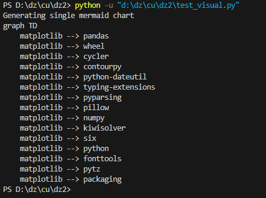
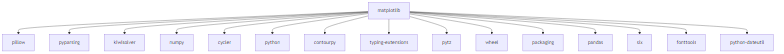
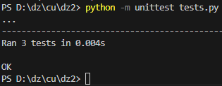

# Визуализатор графа зависимостей

Этот проект представляет собой инструмент командной строки для визуализации графов зависимостей пакетов Python, включая их транзитивные зависимости. Вывод предоставляется в формате Mermaid для легкого представления в графической форме.

## Особенности

- Чтение зависимостей пакетов из указанного текстового файла.
- Поддержка визуализации транзитивных зависимостей.
- Вывод графа зависимостей в текстовом формате для удобной проверки.
- Генерация графических представлений графа зависимостей.

## Использование

Чтобы запустить визуализатор, выполните следующую команду в терминале:

```bash
python visual.py
```

Вы увидите вывод в консоли в формате Mermaid, а графическое представление графа зависимостей будет отображено в файле graph.png в текущей директории.

## Пример

Учитывая следующий dependencies.txt:

```yaml
matplotlib==3.6.3
  - contourpy [required: >=1.0.1, installed: 1.0.6]
  - cycler [required: >=0.10, installed: 0.11.0]
  - kiwisolver [required: >=1.0.1, installed: 1.4.4]
  - numpy [required: >=1.17, installed: 1.24.1]
  - pillow [required: >=6.2.0, installed: 9.5.0]
  - pyparsing [required: >=2.3.1, installed: 3.0.9]
  - python [required: >=3.7, installed: 3.8.10]
  - packaging [required: >=20.0, installed: 24.1]
  - fonttools [required: >=4.22.0, installed: 4.34.4]
    - typing-extensions [required: >=3.10.0, installed: 3.10.4.0]
  - pandas [required: >=1.1, installed: 2.2.3]
```

И файл config.yaml, указывающий:
```yaml
package_name: 'matplotlib'
```

Запуск скрипта выведет:



В формате png:



## Тестирование

Чтобы запустить тесты, выполните следующую команду в терминале:

```bash
python -m unittest test_visual.py
```
## Ожидаемые результаты

При успешном запуске тестов вы должны увидеть следущее:

