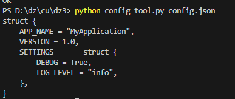
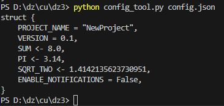
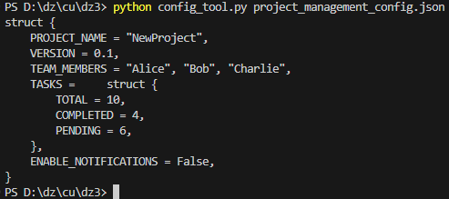
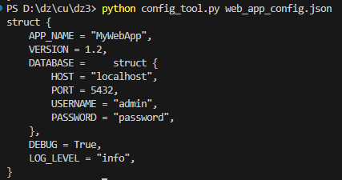
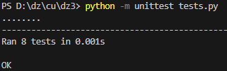

# Конвертер конфигурационного языка

## Обзор

Этот проект предоставляет инструмент командной строки для преобразования JSON-файлов конфигураций в формат пользовательского конфигурационного языка. Он поддерживает словари, списки, константы и булевы значения, обеспечивая структурированный и удобный для чтения вывод. Инструмент также проверяет корректность ключей и обрабатывает вложенные структуры с правильными отступами.

### Основные функции:
- Преобразование JSON-файлов в пользовательский конфигурационный язык.
- Поддержка вложенных словарей (структур), списков и различных типов данных (строки, числа, булевы значения).
- Проверка ключей и значений с обработкой ошибок для неподдерживаемых типов данных или неверных структур.

## Использование

Чтобы использовать инструмент, выполните файл `config_tool.py`, указав путь к вашему JSON-файлу в качестве аргумента командной строки:
```bash
python config_tool.py <путь_к_json_файлу>
```
## Примеры 
### Пример входного JSON
```json
{
    "APP_NAME": "MyApplication",
    "VERSION": 1.0,
    "SETTINGS": {
        "DEBUG": true,
        "LOG_LEVEL": "info"
    }
}
```
### Вывод программы



### Пример входного JSON с операциями
```json
{
    "PROJECT_NAME": "NewProject",
    "VERSION": 0.1,
    "CONST_SUM": "? 3 + 5",
    "CONST_PI": 3.14,
    "CONST_SQRT_TWO": "sqrt 2",
    "ENABLE_NOTIFICATIONS": false
}
```
### Вывод программы



### Пример входного JSON для системы управления проектами
```json
{
    "PROJECT_NAME": "NewProject",
    "VERSION": 0.1,
    "TEAM_MEMBERS": [
        "Alice",
        "Bob",
        "Charlie"
    ],
    "TASKS": {
        "TOTAL": 10,
        "COMPLETED": 4,
        "PENDING": 6
    },
    "ENABLE_NOTIFICATIONS": false
}

```
### Вывод программы



### Пример входного JSON для веб-приложения
```json
{
    "APP_NAME": "MyWebApp",
    "VERSION": 1.2,
    "DATABASE": {
        "HOST": "localhost",
        "PORT": 5432,
        "USERNAME": "admin",
        "PASSWORD": "password"
    },
    "DEBUG": true,
    "LOG_LEVEL": "info"
}

```
### Вывод программы



## Тестирование

Чтобы запустить тесты, выполните следующую команду в терминале:
```bash
python -m unittest tests.py
```
При успешном запуске тестов вы должны увидеть следущее:


